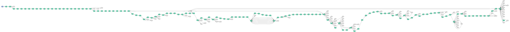
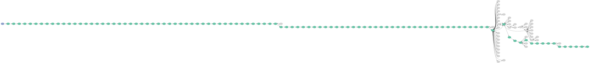
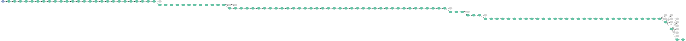
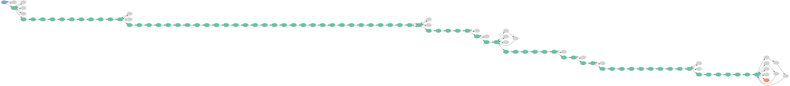

A visual comparison of different revision histories
===================================================

.. code:: python

    import wikivision

.. code:: python

    preteen = wikivision.graph_article_revisions("Preadolescence", highlight=True)
    preteen

.. code:: python

    tern = wikivision.graph_article_revisions("Greater crested tern", highlight=True)
    tern

.. code:: python

    ca_st_rt_57 = wikivision.graph_article_revisions("California State Route 57", highlight=True)
    ca_st_rt_57

.. code:: python

    roman_military = wikivision.graph_article_revisions("Structural history of the Roman military", highlight=True)
    roman_military

.. code:: python

    ca_st_rt_57.format = "svg"
    ca_st_rt_57.render()

.. parsed-literal::

    'Digraph.gv.svg'

