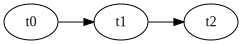
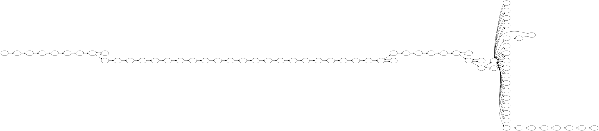
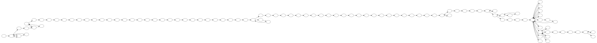

Creating graphs from tables of revisions
========================================

In this notebook I will demonstrate how to draw graphs of Wikipedia
article revision histories using `graphviz <http://www.graphviz.org>`__.

.. code:: python

    import graphviz

If you already know the [DOT
language](https://en.wikipedia.org/wiki/DOT\_(graph\_description\_language),
the quickest way to make graphs is from a ``graphviz.Source`` object.

.. code:: python

    from_dot = graphviz.Source('''
    digraph {
        t0 -> t1 -> t2;
        rankdir=LR;
    }
    ''')
    from_dot

If we want to create graphs like this for article revision histories, we
need a way to create the graph from a table of revisions.

.. code:: python

    from pandas import DataFrame
    edges = DataFrame({'from': ['t0', 't1'], 'to': ['t1', 't2']})
    edges

.. raw:: html

    

    <table border="1" class="dataframe">
      <thead>
        <tr style="text-align: right;">
          <th></th>
          <th>from</th>
          <th>to</th>
        </tr>
      </thead>
      <tbody>
        <tr>
          <th>0</th>
          <td>t0</td>
          <td>t1</td>
        </tr>
        <tr>
          <th>1</th>
          <td>t1</td>
          <td>t2</td>
        </tr>
      </tbody>
    </table>
    

It's easy enough to write a function that makes graphs like the above
from data in a table.

.. code:: python

    def graph(edges, remove_labels=False):
        """Create a simple revision history Digraph from a pandas DataFrame.
        
        Args:
            edges: A DataFrame with two columns, the first is the **from** column
                and the second is the **to** column. Nodes are derived from edges.
            remove_labels: Should the labels be removed from the nodes? Useful
                when graphing actual revision histories and nodes are named with
                long hashes, in which case the labels are probably not needed.
        """
        g = graphviz.Digraph(graph_attr={'rankdir': 'LR'})
        
        # add the nodes
        nodes = set(edges.iloc[:, 0]).union(set(edges.iloc[:, 1]))
        for name in nodes:
            label = '' if remove_labels else name
            g.node(name, label=label)
        
        # add the edges
        g.edges([(from_node, to_node) for _, (from_node, to_node) in edges.iterrows()])
        
        return g

.. code:: python

    graph(edges)

Using wikivision to create graphs from tables of revisions
----------------------------------------------------------

.. code:: python

    import wikivision
    
    def graph_article_revisions(article_slug):
        """Create a Digraph from a Wikipedia article's revision history."""
        revisions = wikivision.get_article_revisions(article_slug)
        revision_edges = revisions[['parent_sha1', 'rev_sha1']].iloc[1:]
        return graph(revision_edges, remove_labels=True)

.. code:: python

    splendid_fairywren = graph_article_revisions('splendid_fairywren')
    splendid_fairywren

.. code:: python

    toothcomb = graph_article_revisions('toothcomb')
    toothcomb

.. code:: python

    splendid_fairywren.render('splendid_fairywren.gv')
    toothcomb.render('toothcomb.gv')

.. parsed-literal::

    'toothcomb.gv.pdf'

