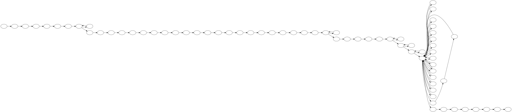

Visualizing Wikipedia article histories
=======================================

Revision trees
--------------

Article histories are linear.

.. code:: python

    import graphviz
    linear = graphviz.Digraph(graph_attr={'rankdir': 'LR'})
    linear.node('t0')
    linear.node('t1')
    linear.node('t2')
    linear.edges([
            ('t0', 't1'),
            ('t1', 't2')
        ])
    linear

But in reality there are a lot of reversions.

.. code:: python

    reversions = graphviz.Digraph(
        graph_attr={'rankdir': 'LR'},
        node_attr={'style': 'filled', 'fontcolor': 'white'},
    )
    reversions.node('t0', label='v0', color='#66c2a5')
    reversions.node('t1', label='v1', color='#fc8d62')
    reversions.node('t2', label='v2', color='#8da0cb')
    reversions.node('t3', label='v1', color='#fc8d62')
    reversions.edges([
            ('t0', 't1'),
            ('t1', 't2'),
            ('t2', 't3'),
        ])
    reversions

.. image:: visualizing-article-histories_files/visualizing-article-histories_5_0.svg

A better way to show article histories is as a tree.

.. code:: python

    full_tree = graphviz.Digraph(
        graph_attr={'rankdir': 'LR'},
        node_attr={'style': 'filled', 'fontcolor': 'white'},
    )
    full_tree.node('v0', color='#66c2a5')
    full_tree.node('v1')
    full_tree.node('v2', color='#fc8d62')
    full_tree.node('v3', color='#8da0cb')
    full_tree.node('v4')
    full_tree.node('v5')
    full_tree.node('v6', color='#e78ac3')
    full_tree.node('v7', color='#a6d854')
    
    full_tree.edges([
            ('v0', 'v1'),
            ('v1', 'v0'),
            ('v0', 'v2'),
            ('v2', 'v3'),
            ('v3', 'v4'),
            ('v4', 'v3'),
            ('v3', 'v5'),
            ('v5', 'v3'),
            ('v3', 'v6'),
            ('v6', 'v7'),
        ])
    full_tree

.. image:: visualizing-article-histories_files/visualizing-article-histories_7_0.svg

What does a real Wikipedia article look like?
---------------------------------------------

To draw a real revision tree, first we need to get all of the revisions
to an article.

.. code:: python

    import wikivision
    revisions = wikivision.get_article_revisions('splendid_fairywren')
    revisions.head(n=4)

.. raw:: html

    

    <table border="1" class="dataframe">
      <thead>
        <tr style="text-align: right;">
          <th></th>
          <th>rev_id</th>
          <th>parent_id</th>
          <th>timestamp</th>
          <th>wikitext</th>
          <th>rev_sha1</th>
          <th>parent_sha1</th>
          <th>rev_version</th>
          <th>parent_version</th>
          <th>rev_type</th>
        </tr>
      </thead>
      <tbody>
        <tr>
          <th>0</th>
          <td>129420980</td>
          <td>0</td>
          <td>2007-05-09 02:59:16</td>
          <td>{{Taxobox\n| color = pink\n| name = Splendid F...</td>
          <td>0860c6aa51c866f79dcc1e54ec994f09c01b37bf</td>
          <td>False</td>
          <td>0</td>
          <td>NaN</td>
          <td>root</td>
        </tr>
        <tr>
          <th>1</th>
          <td>129422530</td>
          <td>129420980</td>
          <td>2007-05-09 03:07:36</td>
          <td>{{Taxobox\n| color = pink\n| name = Splendid F...</td>
          <td>f21f402dd42b893f8301f22cf51063afe8f65e48</td>
          <td>0860c6aa51c866f79dcc1e54ec994f09c01b37bf</td>
          <td>1</td>
          <td>0</td>
          <td>branch</td>
        </tr>
        <tr>
          <th>2</th>
          <td>129539246</td>
          <td>129422530</td>
          <td>2007-05-09 15:41:56</td>
          <td>{{Taxobox\n| color = pink\n| name = Splendid F...</td>
          <td>552a572722c7527358db0a7274fe61ef759306e1</td>
          <td>f21f402dd42b893f8301f22cf51063afe8f65e48</td>
          <td>2</td>
          <td>1</td>
          <td>branch</td>
        </tr>
        <tr>
          <th>3</th>
          <td>129712279</td>
          <td>129539246</td>
          <td>2007-05-10 02:21:32</td>
          <td>{{Taxobox\n| color = pink\n| name = Splendid F...</td>
          <td>833667d437fbe3b2f7aefc538a6acdc9f0b33f5a</td>
          <td>552a572722c7527358db0a7274fe61ef759306e1</td>
          <td>3</td>
          <td>2</td>
          <td>branch</td>
        </tr>
      </tbody>
    </table>
    

.. code:: python

    splendid_fairywren = wikivision.graph_article_revisions('splendid_fairywren')
    splendid_fairywren

.. code:: python

    deepmind = wikivision.graph_article_revisions('Google_DeepMind')
    deepmind

.. code:: python

    shepseskare = wikivision.graph_article_revisions('Shepseskare')
    shepseskare

.. image:: visualizing-article-histories_files/visualizing-article-histories_13_0.svg

What do edit wars look like?
----------------------------

`Wikipedia's lamest edit
wars <http://www.informationisbeautiful.net/visualizations/wikipedia-lamest-edit-wars/>`__.

.. code:: python

    preteen = wikivision.graph_article_revisions('Preadolescence')
    preteen

.. code:: python

    street_fighter = wikivision.graph_article_revisions('Balrog_(Street_Fighter)')
    street_fighter

Counting edits
--------------

This is how edits should be counted.

.. code:: python

    simple = graphviz.Graph(
        graph_attr={'rankdir': 'LR'},
        node_attr={'style': 'filled', 'fontcolor': 'white'},
    )
    simple.node('v0', label='1', color='#66c2a5')
    simple.node('v1', label='')
    simple.node('v2', label='2', color='#fc8d62')
    simple.node('v3', label='3', color='#8da0cb')
    simple.node('v4', label='')
    simple.node('v5', label='')
    simple.node('v6', label='4', color='#e78ac3')
    simple.node('v7', label='5', color='#a6d854')
    
    simple.edges([
            ('v0', 'v1'),
            ('v0', 'v2'),
            ('v2', 'v3'),
            ('v3', 'v4'),
            ('v3', 'v5'),
            ('v3', 'v6'),
            ('v6', 'v7'),
        ])
    simple

.. code:: python

    shepseskare = wikivision.graph_article_revisions('Shepseskare', highlight=True)
    shepseskare

.. code:: python

    preteen = wikivision.graph_article_revisions('Preadolescence', highlight=True)
    preteen

.. image:: visualizing-article-histories_files/visualizing-article-histories_22_0.svg

.. code:: python

    preteen.render('visualizing-article-histories-files/preteen.gv')
    shepseskare.render('visualizing-article-histories-files/shepseskare.gv')

.. parsed-literal::

    'visualizing-article-histories-files/shepseskare.gv.pdf'

