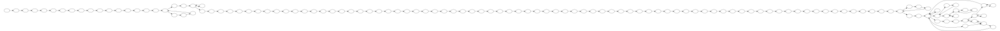

Visualizing Wikipedia article histories
=======================================

.. code:: python

    import graphviz

Article histories are linear.

.. code:: python

    linear = graphviz.Digraph(graph_attr={'rankdir': 'LR'})
    linear.node('t0')
    linear.node('t1')
    linear.node('t2')
    linear.edges([
            ('t0', 't1'),
            ('t1', 't2')
        ])
    linear

.. image:: visualizing-article-histories_files/visualizing-article-histories_3_0.svg

But in reality there are a lot of reversions.

.. code:: python

    reversions = graphviz.Digraph(
        graph_attr={'rankdir': 'LR'},
        node_attr={'style': 'filled', 'fontcolor': 'white'},
    )
    reversions.node('t0', label='v0', color='blue')
    reversions.node('t1', label='v1', color='green')
    reversions.node('t2', label='v2', color='red')
    reversions.node('t3', label='v1', color='green')
    reversions.edges([
            ('t0', 't1'),
            ('t1', 't2'),
            ('t2', 't3'),
        ])
    reversions

.. image:: visualizing-article-histories_files/visualizing-article-histories_5_0.svg

A better way to show article histories is as a tree.
~~~~~~~~~~~~~~~~~~~~~~~~~~~~~~~~~~~~~~~~~~~~~~~~~~~~

.. code:: python

    full_tree = graphviz.Digraph(
        graph_attr={'rankdir': 'LR'},
        node_attr={'style': 'filled', 'fontcolor': 'white'},
    )
    full_tree.node('v0', color='blue')
    full_tree.node('v1')
    full_tree.node('v2', color='green')
    full_tree.node('v3', color='red')
    full_tree.node('v4')
    full_tree.node('v5')
    full_tree.node('v6', color='orange')
    full_tree.node('v7', color='purple')
    
    full_tree.edges([
            ('v0', 'v1'),
            ('v1', 'v0'),
            ('v0', 'v2'),
            ('v2', 'v3'),
            ('v3', 'v4'),
            ('v4', 'v3'),
            ('v3', 'v5'),
            ('v5', 'v3'),
            ('v3', 'v6'),
            ('v6', 'v7'),
        ])
    full_tree

.. image:: visualizing-article-histories_files/visualizing-article-histories_7_0.svg

This is how edits should be counted.
~~~~~~~~~~~~~~~~~~~~~~~~~~~~~~~~~~~~

.. code:: python

    simple = graphviz.Graph(
        graph_attr={'rankdir': 'LR'},
        node_attr={'style': 'filled', 'fontcolor': 'white'},
    )
    simple.node('v0', label='0', color='blue')
    simple.node('v1', label='')
    simple.node('v2', label='1', color='green')
    simple.node('v3', label='2', color='red')
    simple.node('v4', label='')
    simple.node('v5', label='')
    simple.node('v6', label='3', color='orange')
    simple.node('v7', label='4', color='purple')
    
    simple.edges([
            ('v0', 'v1'),
            ('v0', 'v2'),
            ('v2', 'v3'),
            ('v3', 'v4'),
            ('v3', 'v5'),
            ('v3', 'v6'),
            ('v6', 'v7'),
        ])
    simple

.. image:: visualizing-article-histories_files/visualizing-article-histories_9_0.svg

What does a real Wikipedia article look like?
=============================================

.. code:: python

    import wikivision
    revisions = wikivision.get_article_revisions('splendid_fairywren')
    revisions.head()

.. raw:: html

    

    <table border="1" class="dataframe">
      <thead>
        <tr style="text-align: right;">
          <th></th>
          <th>rev_id</th>
          <th>parent_id</th>
          <th>timestamp</th>
          <th>wikitext</th>
          <th>rev_sha1</th>
          <th>parent_sha1</th>
          <th>rev_version</th>
          <th>parent_version</th>
          <th>rev_type</th>
        </tr>
      </thead>
      <tbody>
        <tr>
          <th>365</th>
          <td>129420980</td>
          <td>0</td>
          <td>2007-05-09 02:59:16</td>
          <td>{{Taxobox\n| color = pink\n| name = Splendid F...</td>
          <td>0860c6aa51c866f79dcc1e54ec994f09c01b37bf</td>
          <td>False</td>
          <td>0</td>
          <td>0</td>
          <td>NaN</td>
        </tr>
        <tr>
          <th>364</th>
          <td>129422530</td>
          <td>129420980</td>
          <td>2007-05-09 03:07:36</td>
          <td>{{Taxobox\n| color = pink\n| name = Splendid F...</td>
          <td>f21f402dd42b893f8301f22cf51063afe8f65e48</td>
          <td>0860c6aa51c866f79dcc1e54ec994f09c01b37bf</td>
          <td>1</td>
          <td>0</td>
          <td>branch</td>
        </tr>
        <tr>
          <th>363</th>
          <td>129539246</td>
          <td>129422530</td>
          <td>2007-05-09 15:41:56</td>
          <td>{{Taxobox\n| color = pink\n| name = Splendid F...</td>
          <td>552a572722c7527358db0a7274fe61ef759306e1</td>
          <td>f21f402dd42b893f8301f22cf51063afe8f65e48</td>
          <td>2</td>
          <td>1</td>
          <td>branch</td>
        </tr>
        <tr>
          <th>362</th>
          <td>129712279</td>
          <td>129539246</td>
          <td>2007-05-10 02:21:32</td>
          <td>{{Taxobox\n| color = pink\n| name = Splendid F...</td>
          <td>833667d437fbe3b2f7aefc538a6acdc9f0b33f5a</td>
          <td>552a572722c7527358db0a7274fe61ef759306e1</td>
          <td>3</td>
          <td>2</td>
          <td>branch</td>
        </tr>
        <tr>
          <th>361</th>
          <td>129753223</td>
          <td>129712279</td>
          <td>2007-05-10 06:14:07</td>
          <td>{{Taxobox\n| color = pink\n| name = Splendid F...</td>
          <td>c0f01ff3330b8db49f6134aa059f439b2c4955bf</td>
          <td>833667d437fbe3b2f7aefc538a6acdc9f0b33f5a</td>
          <td>4</td>
          <td>3</td>
          <td>branch</td>
        </tr>
      </tbody>
    </table>
    

.. code:: python

    def graph(edges, remove_labels=False):
        """Create a simple revision history Digraph from a pandas DataFrame.
        
        Args:
            edges: A DataFrame with two columns, the first is the **from** column
                and the second is the **to** column. Nodes are derived from edges.
            remove_labels: Should the labels be removed from the nodes? Useful
                when graphing actual revision histories and nodes are named with
                long hashes, in which case the labels are probably not needed.
        """
        g = graphviz.Digraph(graph_attr={'rankdir': 'LR'})
        
        # add the nodes
        nodes = set(edges.iloc[:, 0]).union(set(edges.iloc[:, 1]))
        for name in nodes:
            label = '' if remove_labels else name
            g.node(name, label=label)
        
        # add the edges
        g.edges([(from_node, to_node) for _, (from_node, to_node) in edges.iterrows()])
        
        return g
    
    def graph_article_revisions(article_slug):
        """Create a Digraph from a Wikipedia article's revision history."""
        revisions = wikivision.get_article_revisions(article_slug)
        revision_edges = revisions[['parent_sha1', 'rev_sha1']].iloc[1:]
        return graph(revision_edges, remove_labels=True)

.. code:: python

    graph_article_revisions('splendid_fairywren')

.. code:: python

    graph_article_revisions('Google_DeepMind')

.. code:: python

    graph_article_revisions('Shepseskare')

