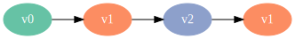

Visualizing Wikipedia article histories
=======================================

.. code:: python

    from graphviz import Digraph, Graph

Article histories are linear.
~~~~~~~~~~~~~~~~~~~~~~~~~~~~~

.. code:: python

    linear = Digraph(graph_attr={'rankdir': 'LR'})
    linear.node('t0')
    linear.node('t1')
    linear.node('t2')
    linear.edges([
            ('t0', 't1'),
            ('t1', 't2')
        ])
    linear

.. image:: visualizing-article-histories_files/visualizing-article-histories_3_0.svg

But in reality there are a lot of reversions.
~~~~~~~~~~~~~~~~~~~~~~~~~~~~~~~~~~~~~~~~~~~~~

.. code:: python

    reversions = Digraph(graph_attr={'rankdir': 'LR'}, node_attr={'style': 'filled', 'fontcolor': 'white'})
    reversions.node('t0', label='v0', color='blue')
    reversions.node('t1', label='v1', color='green')
    reversions.node('t2', label='v2', color='red')
    reversions.node('t3', label='v1', color='green')
    reversions.edges([
            ('t0', 't1'),
            ('t1', 't2'),
            ('t2', 't3'),
        ])
    reversions

A better way to show article histories is as a tree.
~~~~~~~~~~~~~~~~~~~~~~~~~~~~~~~~~~~~~~~~~~~~~~~~~~~~

.. code:: python

    full_tree = Digraph(graph_attr={'rankdir': 'LR'}, node_attr={'style': 'filled', 'fontcolor': 'white'})
    full_tree.node('v0', color='blue')
    full_tree.node('v1')
    full_tree.node('v2', color='green')
    full_tree.node('v3', color='red')
    full_tree.node('v4')
    full_tree.node('v5')
    full_tree.node('v6', color='orange')
    full_tree.node('v7', color='purple')
    
    full_tree.edges([
            ('v0', 'v1'),
            ('v1', 'v0'),
            ('v0', 'v2'),
            ('v2', 'v3'),
            ('v3', 'v4'),
            ('v4', 'v3'),
            ('v3', 'v5'),
            ('v5', 'v3'),
            ('v3', 'v6'),
            ('v6', 'v7'),
        ])
    full_tree

This is how edits should be counted.
~~~~~~~~~~~~~~~~~~~~~~~~~~~~~~~~~~~~

.. code:: python

    simple = Graph(graph_attr={'rankdir': 'LR'}, node_attr={'style': 'filled', 'fontcolor': 'white'})
    simple.node('v0', label='0', color='blue')
    simple.node('v1', label='')
    simple.node('v2', label='1', color='green')
    simple.node('v3', label='2', color='red')
    simple.node('v4', label='')
    simple.node('v5', label='')
    simple.node('v6', label='3', color='orange')
    simple.node('v7', label='4', color='purple')
    
    simple.edges([
            ('v0', 'v1'),
            ('v0', 'v2'),
            ('v2', 'v3'),
            ('v3', 'v4'),
            ('v3', 'v5'),
            ('v3', 'v6'),
            ('v6', 'v7'),
        ])
    simple

.. image:: visualizing-article-histories_files/visualizing-article-histories_9_0.svg

What does a real Wikipedia article look like?
=============================================

.. code:: python

    import wikivision
    revisions = wikivision.get_article_revisions('splendid_fairywren')
    revisions.head()

.. raw:: html

    

    <table border="1" class="dataframe">
      <thead>
        <tr style="text-align: right;">
          <th></th>
          <th>article_slug</th>
          <th>timestamp</th>
          <th>wikitext</th>
        </tr>
      </thead>
      <tbody>
        <tr>
          <th>365</th>
          <td>splendid_fairywren</td>
          <td>2007-05-09 02:59:16</td>
          <td>{{Taxobox\n| color = pink\n| name = Splendid F...</td>
        </tr>
        <tr>
          <th>364</th>
          <td>splendid_fairywren</td>
          <td>2007-05-09 03:07:36</td>
          <td>{{Taxobox\n| color = pink\n| name = Splendid F...</td>
        </tr>
        <tr>
          <th>363</th>
          <td>splendid_fairywren</td>
          <td>2007-05-09 15:41:56</td>
          <td>{{Taxobox\n| color = pink\n| name = Splendid F...</td>
        </tr>
        <tr>
          <th>362</th>
          <td>splendid_fairywren</td>
          <td>2007-05-10 02:21:32</td>
          <td>{{Taxobox\n| color = pink\n| name = Splendid F...</td>
        </tr>
        <tr>
          <th>361</th>
          <td>splendid_fairywren</td>
          <td>2007-05-10 06:14:07</td>
          <td>{{Taxobox\n| color = pink\n| name = Splendid F...</td>
        </tr>
      </tbody>
    </table>
    

.. code:: python

    nodes = revisions.sha.unique()
    edges = revisions[['sha1', 'parent_sha1']].to_records(index=False)
    
    splendid_fairywren = Digraph(node_attr={'label': ''})
    for name in nodes:
        splendid_fairywren.node(name)
    splendid_fairywren.edges(edges)
    splendid_fairywren

::

    ---------------------------------------------------------------------------

    AttributeError                            Traceback (most recent call last)

    <ipython-input-55-7401cad5bfb9> in <module>()
    ----> 1 nodes = revisions.sha.unique()
          2 edges = revisions[['sha1', 'parent_sha1']].to_records(index=False)
          3 
          4 splendid_fairywren = Digraph(node_attr={'label': ''})
          5 for name in nodes:

    /Users/pierce/.venvs/wikivision/lib/python3.5/site-packages/pandas/core/generic.py in __getattr__(self, name)
       2358                 return self[name]
       2359             raise AttributeError("'%s' object has no attribute '%s'" %
    -> 2360                                  (type(self).__name__, name))
       2361 
       2362     def __setattr__(self, name, value):

    AttributeError: 'DataFrame' object has no attribute 'sha'

